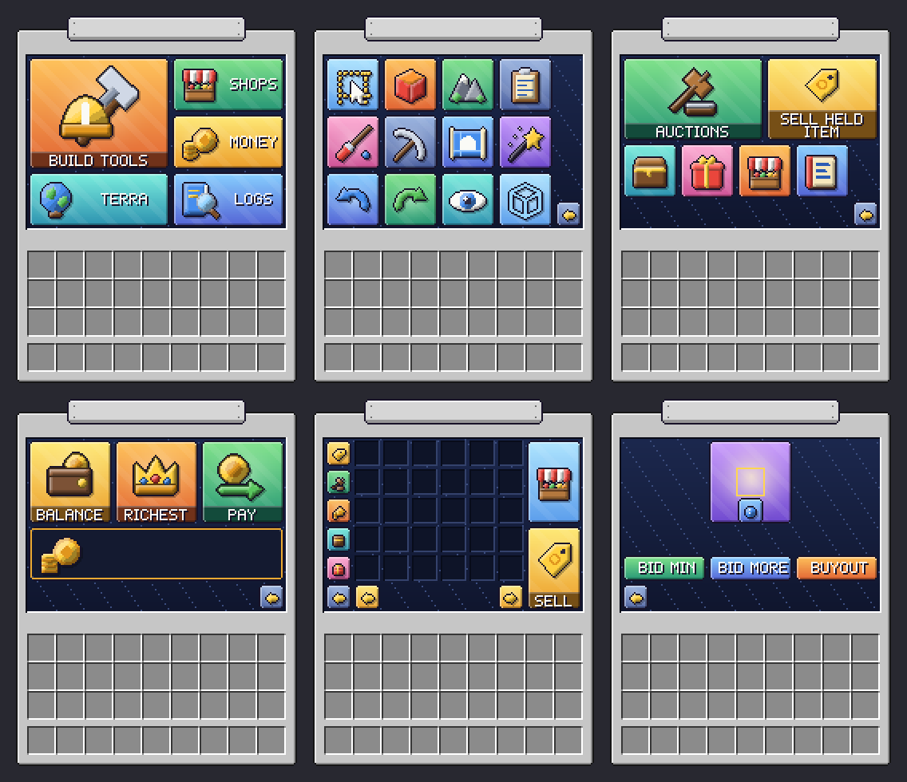

# Harvest resource pack

Illustrated menu windows for the [Harvest](https://github.com/JawshTheDark/harvesteco) plugin suite for
[Pumpkin](https://github.com/Pumpkin-MC/Pumpkin) (HarvestEco, HarvestShops, HarvestEdit, HarvestLog, HarvestTerra).



Big illustrated tiles, a title plate over the window's top edge, a navy inset and a vanilla-style frame. The text on the plate,
the page numbers and the balance are drawn in a pixel font the pack provides, so they can change while the art stays put.

Every sprite and window is generated by `generate.py` (needs Pillow), so the whole thing can be re-themed and rebuilt:

```
pip install pillow
python generate.py
```

That writes `harvest_pack/`, `harvest-pack.zip` and `harvest-pack.sha1`, and the menu data the plugins read.

- `pxl.py`: the 5x7 pixel font and the shaded-sprite toolkit.
- `sprites.py`: about 70 illustrations, drawn in unit coordinates so they work at any size.
- `panels.py`: tiles, buttons, the window frame and the title plate.
- `generate.py`: lays out each menu, writes the pack.
- **Your own art:** put a PNG named after a sprite in `art/` (for example `art/builder.png`) and it replaces the drawing.

## Use it on a server

In `pumpkin.toml`:

```toml
[resource_pack.java]
enabled = true
url = "https://github.com/JawshTheDark/harvest-pack/releases/download/v2.2.0/harvest-pack.zip"
sha1 = "<contents of harvest-pack.sha1>"
prompt_message = "Harvest menus"
force = false
```

Players who decline the pack still get working menus, with plain paper items and a blank frame in place of the art.

## How it works

A chest menu's window title is a text component in the pack's fonts: one character moves the cursor left, one is a 176x230 glyph
that is the whole window, and the title and other text follow on top of it. The items in the slots are invisible
(`harvest:blank`), so the art shows through; the slots only supply tooltips and clicks.

MIT licensed.
